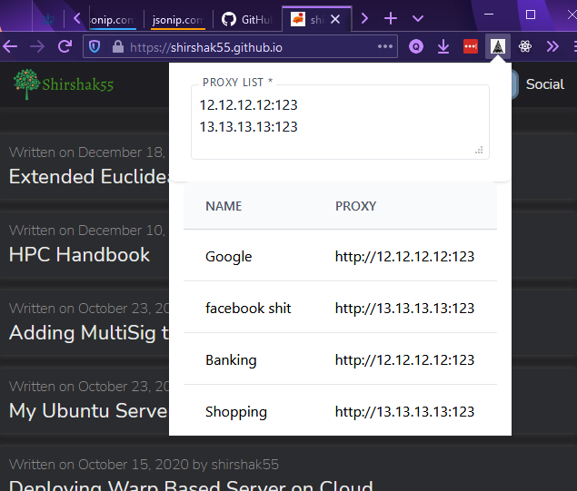

### Firefox Simple Container Proxy

### Screenshots



### Brief Description

For some usecase I need a proxy support on firefox. I wanted to use different
proxy for different containers. If you don't know firefox containers think of it
as different cookie store.

As web has become too wild I can't trust going to random website. So I usually
run those website in container and I trust the firefox container and expect it
not to leak any cookies from one container to another container. But the
container lacks proxy feature.

So this extension is made to make that feature available. There is firefox
container proxy and it is good. But it is not simple to add proxies etc. And I
wanted some rotating proxies. So if I have 10 container and 2 proxies I want to
rotate 2 proxies to every container in round robin fashion.

### Why to use?

1. Works with HTTP proxy
2. Made with <3
3. Author is very open towards contribution

### Gotcha

1. Works only on firefox
2. HTTP proxy only (for now)

### Building

```bash
$ yarn
$ yarn dev
```

Look on package.json scripts for more details

Currently I haven't added any socks support etc. But its not that hard and
requires only few change. If you need that feature please raise the issue I am
happy to implement it.

### Thanks

-   Shirshak55
